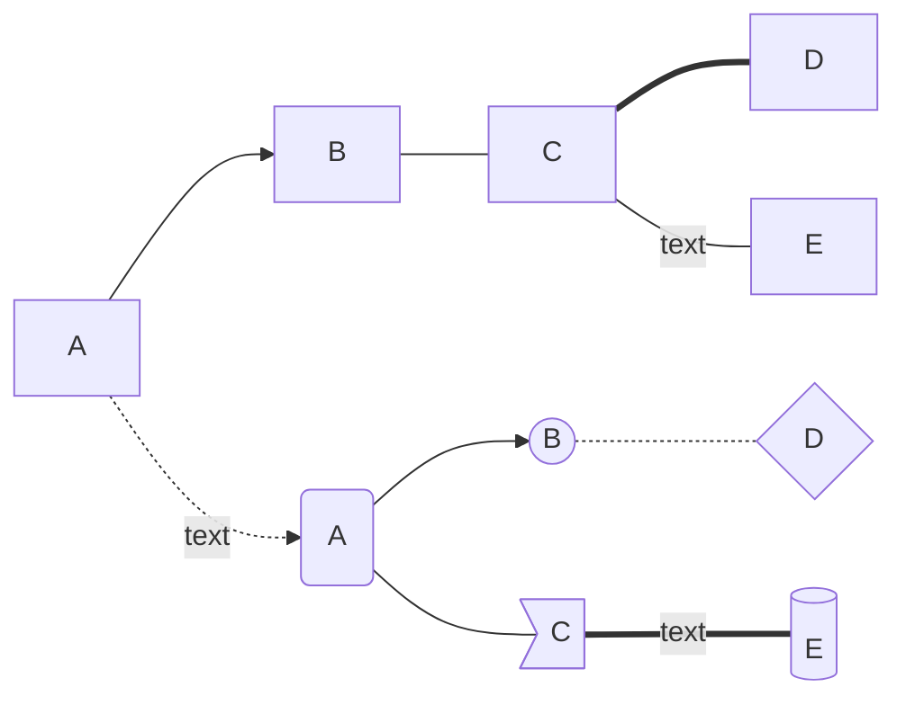
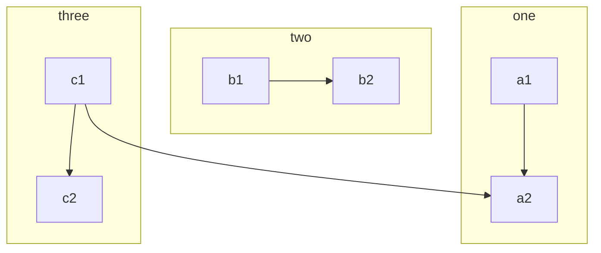
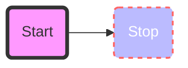
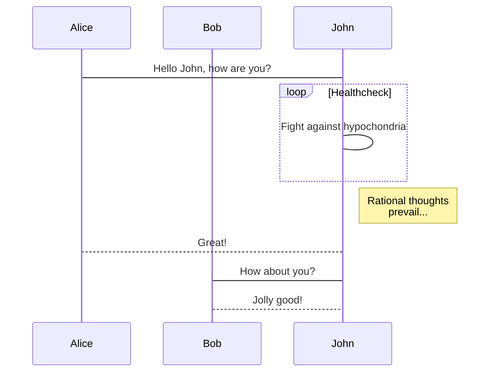
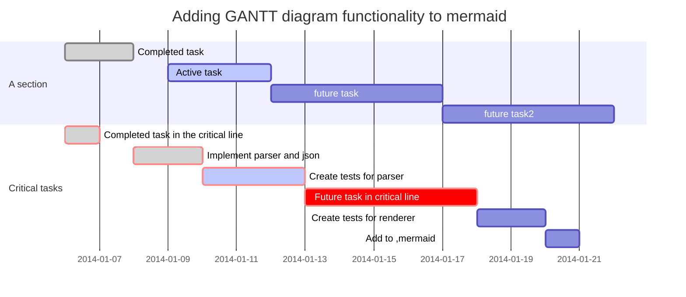
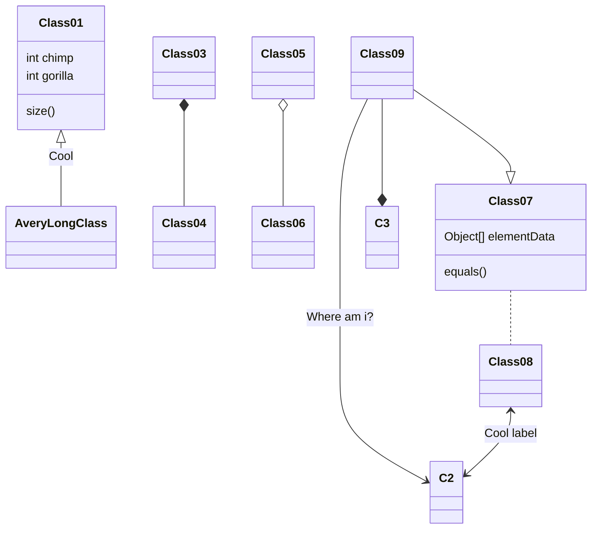
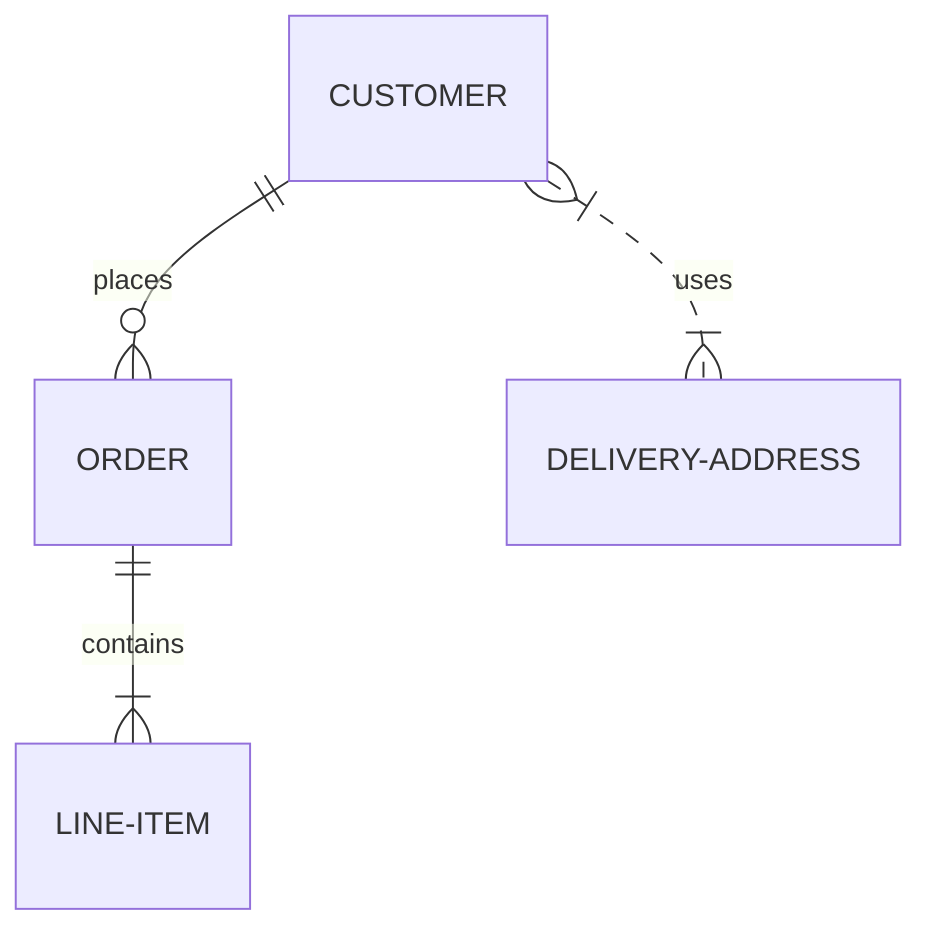
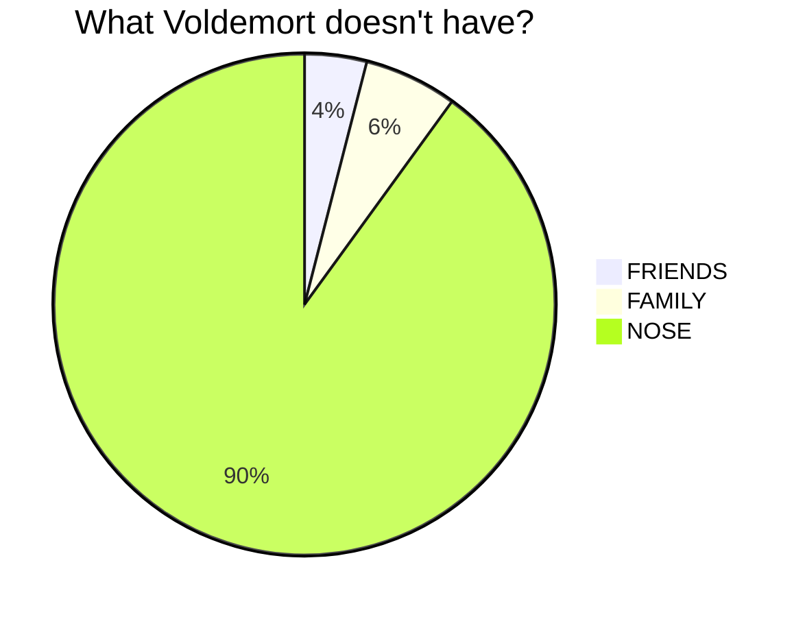
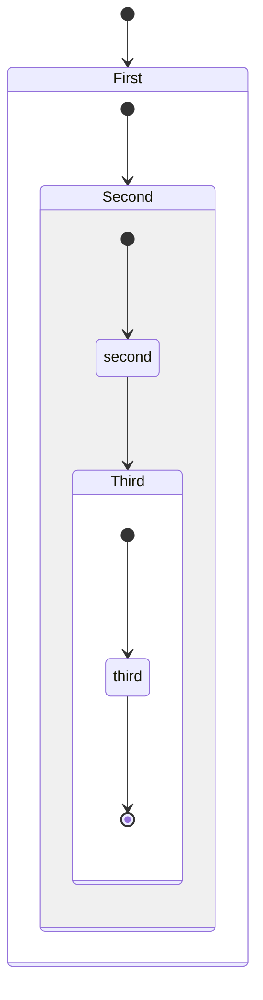
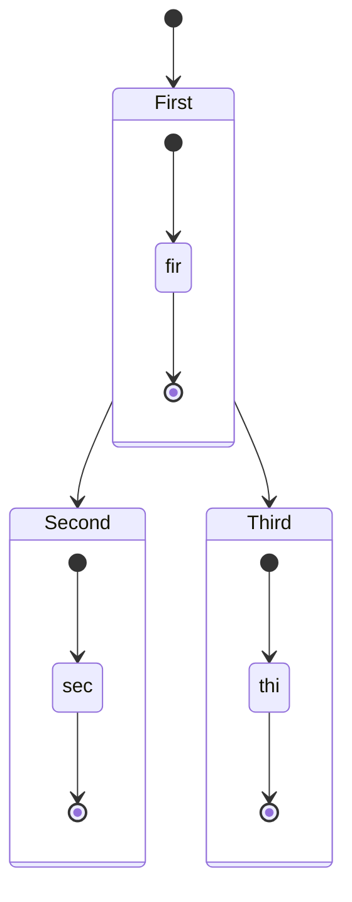

部分示例来自 <https://mermaid-js.github.io/mermaid>

<!--more-->

## Flowchart

## Sequence diagram

## Gantt diagram

## Class diagram - experimental

## Git graph - experimental

## Entity Relationship Diagram - experimental

## Pie Chart

## State Diagram

